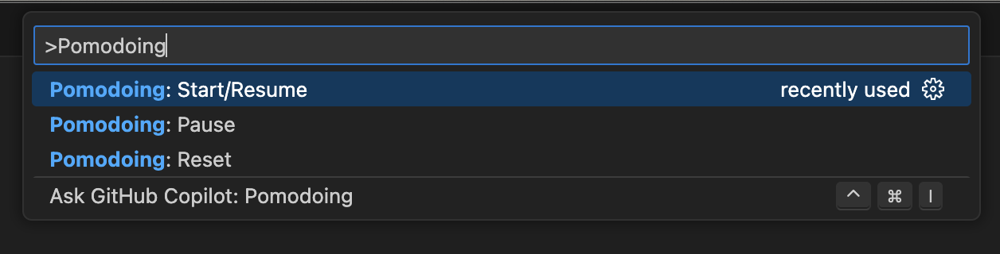

# Pomodoing - VS Code Extension

Pomodoing is a Visual Studio Code extension that allows you to work with Pomodoro Timer right in the favourite IDE.

## Features

- **Start Timer**: Starts the timer.
- **Pause Timer**: Pauses timer and lets you resume from this point if you decide to start it again.
- **Configuration**: Extension configuration helps to customise break time, working time and lots of other different settings.

## Installation

1. Open the Extensions view by clicking on the Extensions icon in the Activity Bar on the side of the window or by pressing `Ctrl+Shift+X`.
2. Search for "Pomodoing" and click Install.
3. Reload VS Code to activate the extension.

## Usage

1. Open a file in a Git repository.
2. Open the command palette (`Ctrl+Shift+P`) and type `Pomodoing: Start/Resume`.
3. You may see a countdown with a current state in the bottom panel of your VSCode.
4. The extension will change the states eventually.

### Additional Commands

- `Pomodoing: Pause` - Pauses the timer.
- `Pomodoing: Reset` - Resets the timer and starts from the beginning.

### Indications

- **Work**: The timer is running and you should be working.
  

- **Pause**: The timer is paused and you can take a break.
  

## Requirements

- Visual Studio Code

## Extension Settings

This extension provides extensive settings opportunities

## Known Limitations

- Needs some extra controls from editor top bar.

## Release Notes

### 1.0.0

- Initial release of Quick Commit

## Meta Information

**Publisher**: Pulko

**Company Website**: [https://pulko-app.com](https://pulko-app.com)

**LinkedIn**: [https://linkedin.com/in/fedor-tkachenko](https://linkedin.com/in/fedor-tkachenko)

**Source Code Repository**: [https://github.com/Pulko/pomodoing](https://github.com/Pulko/pomodoing)
